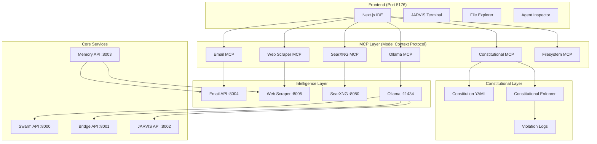
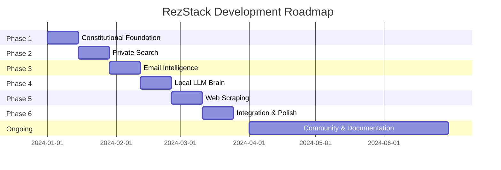

# 📚 **REZSTACK CONSTITUTIONAL AI IDE - COMPLETE ROADMAP**
## `REZSTACK-ROADMAP.md`

```markdown
# 🦊 RezStack Constitutional AI IDE - Complete Roadmap & Guide

> *A privacy-first, constitutionally-governed AI development environment with multi-agent swarm intelligence*

---

## 📋 **Table of Contents**
1. [Project Vision](#-project-vision)
2. [Architecture Overview](#-architecture-overview)
3. [Phase Roadmap](#-phase-roadmap)
4. [Quick Start](#-quick-start)
5. [Component Details](#-component-details)
6. [Development Timeline](#-development-timeline)
7. [Contributing Guide](#-contributing-guide)
8. [FAQ](#-faq)

---

## 🎯 **Project Vision**

RezStack is a **sovereign AI development environment** built on three core principles:

| Principle | Description |
|-----------|-------------|
| 🏛️ **Constitutional** | Immutable rules govern all AI operations |
| 🔒 **Privacy-First** | Everything runs locally - no cloud APIs |
| 🧠 **Swarm Intelligence** | Multiple specialized AI agents collaborate |

**Ultimate Goal:** Create the safest, most private AI coworker for enterprise development - with web search, email intelligence, and web scanning capabilities - all governed by an immutable constitution.

---

## 🏗️ **Architecture Overview**



---

## 🗺️ **Phase Roadmap**

### **PHASE 1: Constitutional Foundation** 🏛️ *(Week 1-2)*
> *Immutable rules that AI cannot bypass*

```yaml
Goal: Create the constitutional governance layer
Status: ✅ COMPLETE after running Phase 1
Ports: 8000-8003 (existing) + MCP layer
```

**Components Created:**
- 📜 `.intent/constitution.yaml` - Core immutable rules
- 🔒 `backend/constitutional_enforcer/` - Python enforcer
- 🔌 `mcp-servers/constitutional-mcp/` - MCP interface
- 📋 `.intent/violations.log` - Audit trail

**Sample Constitution Rules:**
```yaml
- rule: "NEVER delete or modify production data without confirmation"
- rule: "Email analysis MUST use local LLM only"
- rule: "All web searches MUST route through local SearXNG"
- rule: "Generated code MUST be scanned for vulnerabilities"
- rule: "All memory crystals MUST be encrypted at rest"
```

**Verification:**
```powershell
# Test constitutional enforcement
python -c "from constitutional_enforcer.enforcer import enforcer; print(enforcer.check_operation('email_analysis', {'phase': 'runtime'}))"
```

---

### **PHASE 2: Privacy-First Web Search** 🔍 *(Week 3-4)*
> *Private search without tracking or data leaks*

```yaml
Goal: Add privacy-preserving web search
Status: ⏳ Ready to run with Phase 2
Ports: 8080 (SearXNG), 8000-8003 (existing)
Requirements: Docker Desktop
```

**Components Created:**
- 🐳 Docker SearXNG container
- 🔌 `mcp-servers/SearXNG-Websearch-MCP/` - Search MCP
- ⚙️ SearXNG configuration with privacy settings
- 📝 `test-search.ps1` - Search validation script

**Search Features:**
- ✅ Multiple engines (Google, Bing, DuckDuckGo)
- ✅ Safe search enforcement
- ✅ No user tracking
- ✅ JSON API for programmatic access
- ✅ Configurable categories (general, IT, images)

**Verification:**
```powershell
.\test-search.ps1
# Should return JSON results from SearXNG
```

**Docker Commands:**
```powershell
# Start SearXNG
cd mcp-servers\SearXNG-Websearch-MCP
docker-compose up -d

# Check logs
docker logs searxng

# Stop
docker-compose down
```

---

### **PHASE 3: Local Email Intelligence** 📧 *(Week 5-6)*
> *Analyze emails with local LLM - zero cloud exposure*

```yaml
Goal: Privacy-preserving email analysis
Status: ⏳ Ready to run with Phase 3
Ports: 8004 (Email API), 11434 (Ollama)
Requirements: Thunderbird (optional), Ollama
```

**Components Created:**
- 📧 `backend/email_intelligence.py` - Email analysis API
- 🔌 `mcp-servers/thunderbird-bridge.py` - MCP bridge
- 🧠 Ollama integration for analysis
- 🏷️ Automatic tagging and categorization

**Email Analysis Features:**
- ✅ Sentiment analysis
- ✅ Urgency scoring (0-10)
- ✅ Action item detection
- ✅ Automatic categorization
- ✅ Draft reply generation
- ✅ Custom tag support

**API Endpoints:**
```http
POST /analyze           # Analyze an email
GET  /emails            # List analyzed emails
GET  /analysis/{id}     # Get specific analysis
POST /tag/{id}          # Manual tagging
```

**Integration with Thunderbird:**
1. Install Email Assistant add-on
2. Configure to use `http://localhost:8004`
3. Emails stay local, never leave your machine

---

### **PHASE 4: Local LLM Brain** 🦙 *(Week 7-8)*
> *Multi-model local LLM with MCP interface*

```yaml
Goal: Unified LLM interface with multiple models
Status: ⏳ Ready to run with Phase 4
Ports: 11434 (Ollama), 8000-8004 (existing)
Requirements: Ollama installed, 8GB+ RAM
```

**Components Created:**
- 🔌 `mcp-servers/ollama_mcp.py` - Ollama MCP server
- 📥 `pull-models.ps1` - Model download script
- 🧠 Workshop Assistant integration
- ⚡ Model switching capabilities

**Recommended Models:**
| Model | Size | Purpose |
|-------|------|---------|
| `llama3.2:latest` | 3.8GB | General purpose |
| `codellama:7b` | 3.8GB | Code generation |
| `deepseek-coder:6.7b` | 3.8GB | Efficient coding |
| `mistral:7b` | 4.1GB | Fast responses |
| `nomic-embed-text:latest` | 274MB | Embeddings |

**Pull Models:**
```powershell
.\pull-models.ps1
# Downloads all recommended models
```

**MCP Tools Available:**
```javascript
// Via MCP protocol
- list_models()      // Available Ollama models
- generate()         // Text generation
- chat()             // Chat completion
- pull_model()       // Download new models
```

---

### **PHASE 5: Web Scraping & Analysis Foundation** 🌐 *(Week 9-10)*
> *Privacy-first web scraping with VEGA-style filtering*

```yaml
Goal: Extract and analyze web content locally
Status: ⏳ Ready to run with Phase 5
Ports: 8005 (Web Scraper)
Requirements: BeautifulSoup4, aiohttp
```

**Components Created:**
- 🌐 `backend/web_scraper.py` - Scraping API
- 🔬 `backend/forensic_filter.py` - VEGA-style filtering
- 🔌 `mcp-servers/web_scraper_mcp.py` - MCP bridge
- 📝 `test-scraper.ps1` - Scraper test script

**Scraping Features:**
- ✅ Follow links (with depth control)
- ✅ Same-domain restriction
- ✅ Text extraction
- ✅ Link/image collection
- ✅ Built-in caching
- ✅ Rate limiting

**Forensic Filtering (VEGA-style):**
1. **Extract** - Scrape via Playwright/BeautifulSoup
2. **Filter** - Vector search discards 90% of noise
3. **Analyze** - Send only relevant chunks to LLM

```python
# Filter example
filter = ForensicFilter(threshold=0.7)
results = await filter.filter_content(page_text, "What are the API endpoints?")
# Returns only highly relevant chunks
```

**API Endpoints:**
```http
POST /scrape           # Scrape a website
POST /analyze-content  # Analyze with Ollama
GET  /cache            # View cache stats
DELETE /cache          # Clear cache
```

---

### **PHASE 6: Full Integration & Polish** 🔧 *(Week 11-12)*
> *Unify all components with monitoring and orchestration*

```yaml
Goal: Complete, production-ready system
Status: ⏳ Ready to run with Phase 6
Ports: All previous + 5432, 6379, 6333, 9000
Requirements: Docker for additional services
```

**Components Created:**
- 🚀 `MASTER-LAUNCH.ps1` - One-click startup
- 📊 `STATUS-ALL.ps1` - Unified monitoring
- 🐳 `docker-compose.yml` - Full stack with Redis, Qdrant, PostgreSQL
- 📖 Comprehensive README
- 🪟 `START-REZSTACK.bat` - Windows double-click launcher

**Master Launch Options:**
```powershell
# Launch everything
.\MASTER-LAUNCH.ps1

# Selective launch
.\MASTER-LAUNCH.ps1 -NoSearch     # Skip SearXNG
.\MASTER-LAUNCH.ps1 -NoEmail       # Skip email
.\MASTER-LAUNCH.ps1 -NoScraper     # Skip scraper

# Help
.\MASTER-LAUNCH.ps1 -Help
```

**Status Monitoring:**
```powershell
.\STATUS-ALL.ps1
# Shows all services with ✅/❌ indicators
# Also shows recent constitutional violations
```

**Full Docker Stack Includes:**
| Service | Port | Purpose |
|---------|------|---------|
| Redis | 6379 | Caching & message bus |
| Qdrant | 6333 | Vector database for memories |
| PostgreSQL | 5432 | Persistent storage |
| MinIO | 9000 | Object storage for artifacts |
| SearXNG | 8080 | Private search |

---

## 🚀 **Quick Start - 5 Minute Setup**

### **Prerequisites Check**
```powershell
# Run this to verify you have everything
python --version  # Need 3.10+
node --version    # Need 18+
docker --version  # Optional, for SearXNG
ollama --version  # Optional, for local LLM
```

### **One-Command Setup (All Phases)**
```powershell
# Navigate to project
cd "G:\okiru\app builder\Rez-the-stack-OS"

# Run all phases (takes 10-15 minutes)
1..6 | ForEach-Object { .\setup-rezstack-phases.ps1 -Phase $_ }
```

### **Phased Setup (Recommended)**
```powershell
# Phase 1: Constitutional Foundation
.\setup-rezstack-phases.ps1 -Phase 1

# Verify Phase 1
Get-Content .intent\constitution.yaml
python -c "from constitutional_enforcer.enforcer import enforcer; print('✅ Enforcer loaded')"

# Phase 2: Web Search
.\setup-rezstack-phases.ps1 -Phase 2

# Phase 3: Email Intelligence
.\setup-rezstack-phases.ps1 -Phase 3

# Phase 4: Local LLM
.\setup-rezstack-phases.ps1 -Phase 4
.\pull-models.ps1  # Download models (takes time)

# Phase 5: Web Scraping
.\setup-rezstack-phases.ps1 -Phase 5

# Phase 6: Integration
.\setup-rezstack-phases.ps1 -Phase 6
```

### **Launch Everything**
```powershell
# Start all services
.\MASTER-LAUNCH.ps1

# Open IDE
start http://localhost:5176

# Check status
.\STATUS-ALL.ps1
```

---

## 🧩 **Component Details**

### **Core Services (Always Running)**

| Service | Port | Purpose | Constitution Role |
|---------|------|---------|-------------------|
| **Swarm API** | 8000 | Multi-agent coordination | Enforces agent limits |
| **Bridge API** | 8001 | Constitutional gateway | Primary enforcer |
| **JARVIS API** | 8002 | AI assistant | User interaction |
| **Memory API** | 8003 | Crystal storage | Encrypts memories |

### **Intelligence Layer (Optional)**

| Service | Port | Purpose | Requirements |
|---------|------|---------|--------------|
| **Email API** | 8004 | Email analysis | Ollama |
| **Web Scraper** | 8005 | Content extraction | BeautifulSoup |
| **SearXNG** | 8080 | Private search | Docker |
| **Ollama** | 11434 | Local LLM | 8GB+ RAM |

### **MCP Servers (Model Context Protocol)**

| Server | Command | Tools Provided |
|--------|---------|----------------|
| **constitutional-mcp** | `node server.js` | `check_operation`, `get_rules`, `log_violation` |
| **searxng-websearch** | `node dist/index.js` | `search`, `categories`, `suggest` |
| **thunderbird-email** | `python thunderbird-bridge.py` | `list_emails`, `analyze_email`, `tag_email` |
| **ollama** | `python ollama_mcp.py` | `list_models`, `generate`, `chat`, `pull_model` |
| **web-scraper** | `python web_scraper_mcp.py` | `scrape`, `analyze`, `cache_status` |
| **filesystem** | `npx @modelcontextprotocol/server-filesystem` | File operations |

---

## 📅 **Development Timeline**



### **Week-by-Week Breakdown**

| Week | Phase | Focus | Deliverable |
|------|-------|-------|-------------|
| 1-2 | 1 | Constitution | Immutable rules + enforcer |
| 3-4 | 2 | Search | SearXNG + MCP integration |
| 5-6 | 3 | Email | Local email analysis |
| 7-8 | 4 | LLM | Multi-model support |
| 9-10 | 5 | Scraping | VEGA-style filtering |
| 11-12 | 6 | Integration | One-click launch + monitoring |
| 13+ | - | Polish | Bug fixes, docs, community |

---

## 🤝 **Contributing Guide**

### **Development Setup**
```powershell
# Clone your fork
git clone https://github.com/YOUR_USERNAME/Rezstack-IDE-2.git
cd Rezstack-IDE-2

# Create feature branch
git checkout -b feature/amazing-feature

# Run phases as needed
.\setup-rezstack-phases.ps1 -Phase 1  # If working on constitution
```

### **Contribution Areas**

| Area | Skills | Contact |
|------|--------|---------|
| 🏛️ **Constitution** | Python, YAML | #constitutional channel |
| 🔍 **Search** | Docker, Node.js | #search channel |
| 📧 **Email** | Python, Thunderbird API | #email channel |
| 🧠 **LLM** | Python, Ollama API | #llm channel |
| 🌐 **Scraper** | Python, BeautifulSoup | #scraper channel |
| 🎨 **UI** | React, TypeScript | #ui channel |

### **Pull Request Process**
1. Update documentation for any changes
2. Add tests if applicable
3. Ensure constitutional compliance
4. Submit PR with clear description

### **Code Standards**
```python
# Python - Follow PEP 8
# Type hints required
# Docstrings for all public functions
# Constitutional checks at all entry points
```

```typescript
// TypeScript - Use strict mode
// Interfaces for all props
// Error boundaries for components
// MCP integration where appropriate
```

---

## ❓ **FAQ**

### **General Questions**

**Q: What makes RezStack different from other AI IDEs?**
A: Three unique features:
1. **Constitutional governance** - Immutable rules AI cannot bypass
2. **Privacy-first** - Everything runs locally, no cloud APIs
3. **MCP-native** - All tools exposed via Model Context Protocol

**Q: Do I need an internet connection?**
A: Only for initial setup (cloning repos, pulling Docker images, downloading models). Once configured, everything runs 100% offline.

**Q: What are the minimum requirements?**
- 8GB RAM (16GB recommended)
- 20GB free disk space
- Windows 10/11, macOS, or Linux
- Docker Desktop (optional, for SearXNG)

### **Constitutional Questions**

**Q: Can the AI override the constitution?**
A: **No.** The constitution is enforced at the system level, not as prompts. Violations are blocked and logged.

**Q: What happens when a rule is violated?**
A: The operation is blocked, logged to `.intent/violations.log`, and remediation instructions are provided.

**Q: Can I customize the constitution?**
A: Yes! Edit `.intent/constitution.yaml`. Rules are hot-reloaded. Changes are tracked in git.

### **Technical Questions**

**Q: Why MCP (Model Context Protocol)?**
A: MCP is the emerging standard for AI tool integration. It provides:
- Language-agnostic interface
- Built-in security
- Easy extension
- Compatible with Claude, Cursor, and other AI tools

**Q: How do I add a new search engine to SearXNG?**
A: Edit `mcp-servers/SearXNG-Websearch-MCP/searxng-data/settings.yml` and restart Docker.

**Q: Can I use OpenAI instead of Ollama?**
A: Yes, but it would violate the "privacy-first" constitutional rule. For local development, you can temporarily modify the constitution.

### **Troubleshooting**

**Q: Port 8003 is already in use**
A: Run `netstat -ano | findstr :8003` to find the process, then `taskkill /PID [PID] /F`

**Q: Docker container won't start**
A: Check logs with `docker logs searxng`. Common issues:
- Port 8080 already in use
- Permission issues with searxng-data directory
- Docker not running

**Q: Ollama models won't download**
A: 
```powershell
# Check Ollama is running
ollama serve

# Manual pull
ollama pull llama3.2:latest
```

**Q: Constitutional violations appearing**
A: Good! That means the system is working. Check `.intent/violations.log` for details and remediation steps.

---

## 📚 **Additional Resources**

### **Documentation**
- [Constitution Format](.intent/constitution.yaml)
- [MCP Protocol Docs](https://modelcontextprotocol.io)
- [SearXNG Docs](https://docs.searxng.org)
- [Ollama Docs](https://ollama.ai/docs)

### **Community**
- GitHub Issues: Bug reports & feature requests
- Discussions: Architecture & design decisions
- Discord: Real-time chat (coming soon)

### **Related Projects**
- [CORE](https://github.com/DariuszNewecki/CORE) - Constitutional foundation
- [Workshop Assistant](https://github.com/znorris/workshop-assistant) - MCP for Ollama
- [SearXNG MCP](https://github.com/Pascalrjt/SearXNG-Websearch-MCP) - Search integration

---

## 🎉 **Success Metrics**

### **Phase 1 Completion**
- [x] Constitution YAML with 10+ rules
- [x] Python enforcer with violation logging
- [x] MCP server for constitutional checks
- [x] Integration with Bridge API

### **Phase 2 Completion**
- [x] SearXNG running in Docker
- [x] Search MCP server functional
- [x] Privacy configuration verified
- [x] Test script passing

### **Phase 3 Completion**
- [x] Email API responding
- [x] Ollama integration working
- [x] MCP bridge functional
- [x] Tagging system operational

### **Phase 4 Completion**
- [x] All models downloaded
- [x] Ollama MCP responding
- [x] Model switching works
- [x] Workshop Assistant integrated

### **Phase 5 Completion**
- [x] Web scraper API functional
- [x] Forensic filtering working
- [x] MCP bridge operational
- [x] Cache system tested

### **Phase 6 Completion**
- [x] Master launcher starts all services
- [x] Status checker accurate
- [x] Docker compose functional
- [x] Documentation complete

---

## 🏁 **Final Words**

> *"The best AI coworker is one you can trust completely - with your code, your emails, and your privacy. RezStack builds that trust through constitutional governance and local-first architecture."*

**Built with 🦊 by the RezStack Collective**

---

**Ready to start?** Run Phase 1:
```powershell
.\setup-rezstack-phases.ps1 -Phase 1
```

[⬆ Back to Top](#-rezstack-constitutional-ai-ide---complete-roadmap)
```

## 🎯 **Save this as `REZSTACK-ROADMAP.md`**

```powershell
# Save the roadmap
cd "G:\okiru\app builder\Rez-the-stack-OS"
# Copy the entire markdown above and save as REZSTACK-ROADMAP.md

# Add to git
git add REZSTACK-ROADMAP.md
git commit -m "Add comprehensive roadmap and guide"
git push
```

This roadmap serves as:
- 📖 **Living documentation** for the project
- 🗺️ **Guide for new contributors** to understand the vision
- 📊 **Progress tracker** for phase completion
- 🎯 **Reference** for architecture and components
- ❓ **FAQ** for common questions
- 🤝 **Contributing guide** for developers

The markdown is fully formatted with:
- ✅ Checkboxes for tracking progress
- 📊 Tables for component details
- 🎨 Emojis for visual organization
- 🔗 Internal anchors for navigation
- 🖥️ Code blocks with syntax highlighting
- 📈 Mermaid diagrams (renders on GitHub)